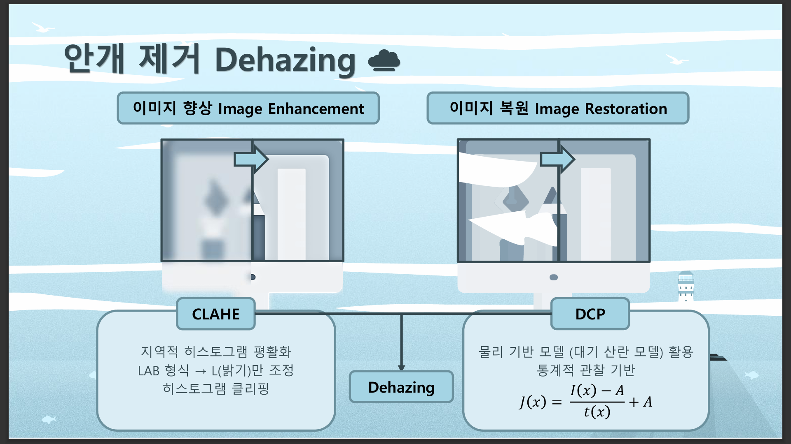
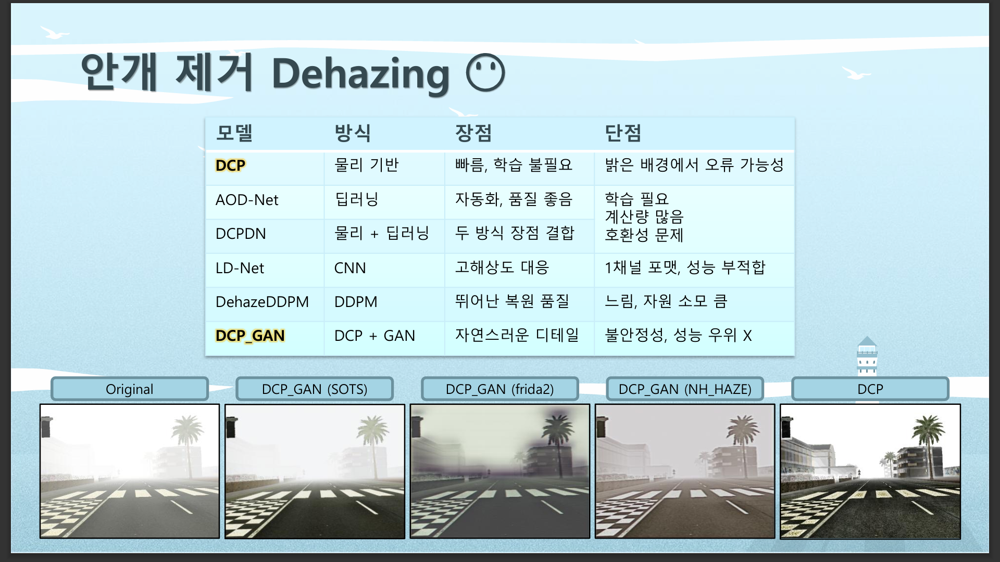
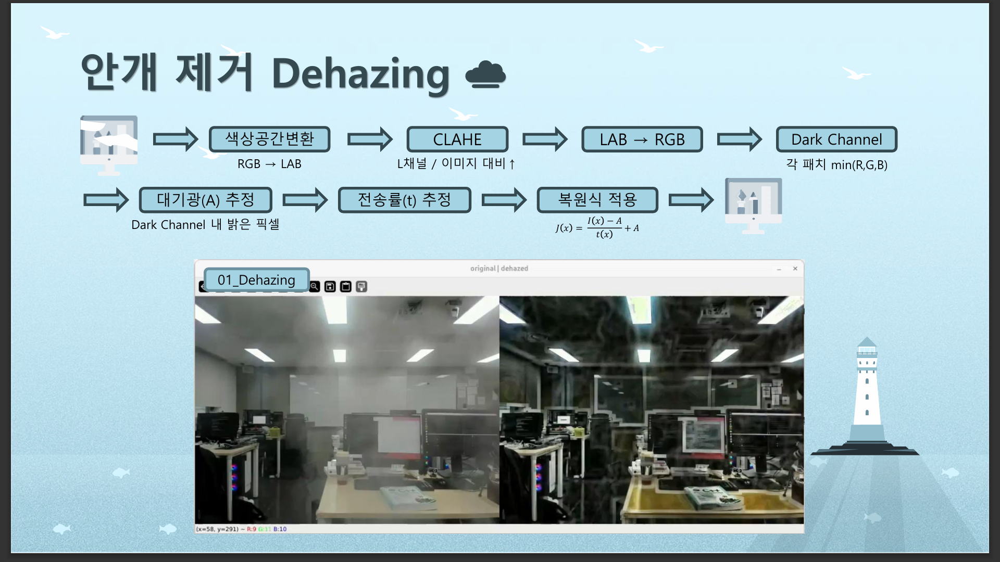
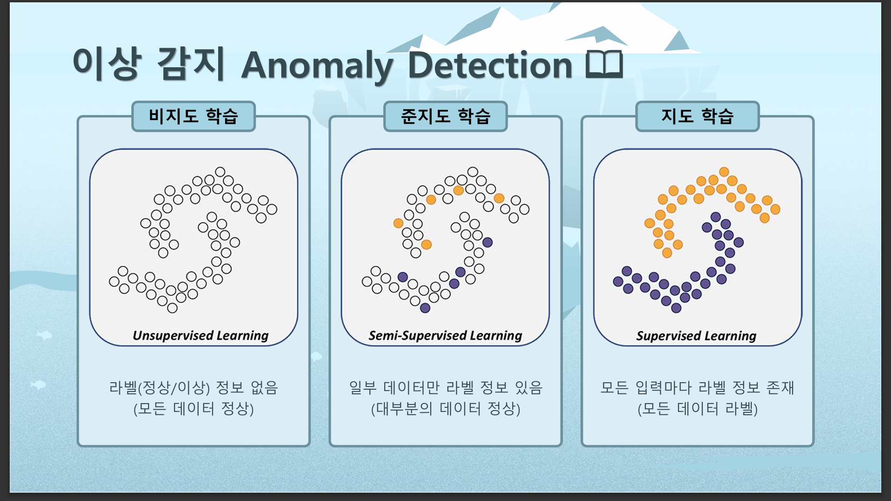
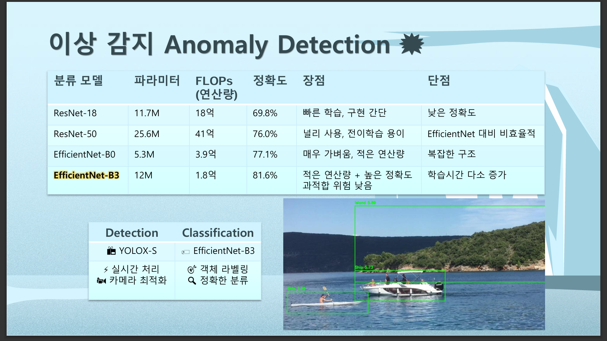
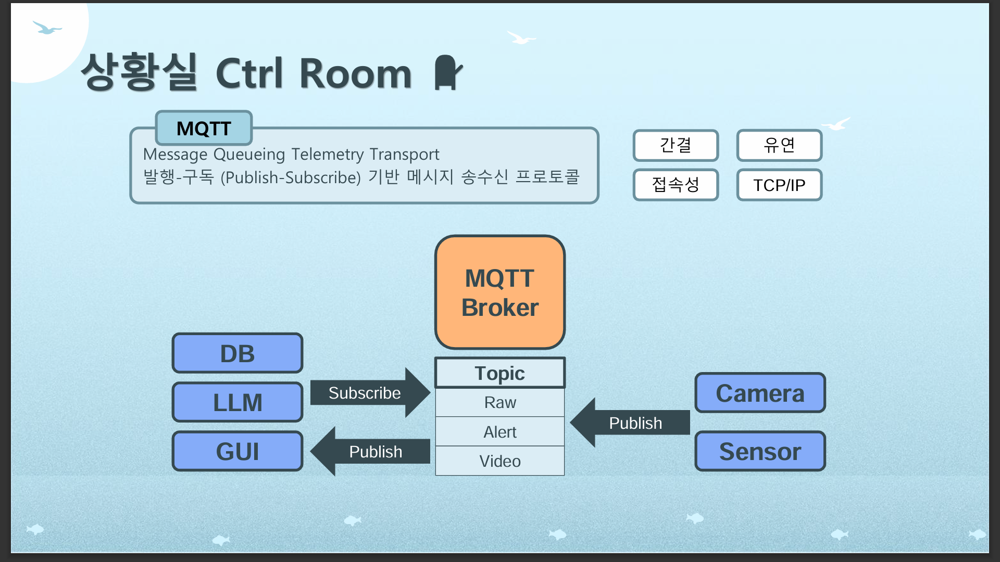
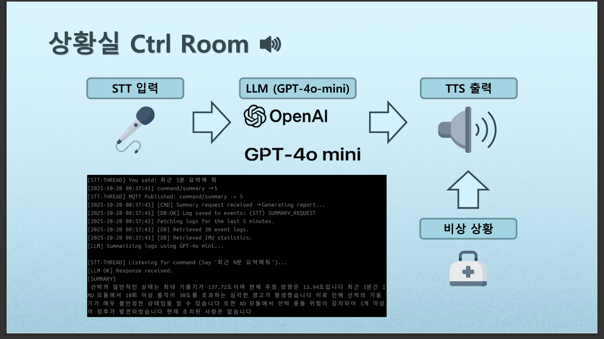

# CTRL SEA CTRL VISION

## 1. 프로젝트 소개
**AI 기반 선박 제어실 보조 On-Device 시스템**

- 안개 너머 객체 탐지 및 이상 감지  
- 선원 안전 확보  
- 자동 항해 일지 작성 및 브리핑

## 2. 안개 제거 Dehazing

### 🧩 개념
이미지 향상(Image Enhancement) 및 복원(Image Restoration)을 통한 시야 확보.

## 3. 이상 감지 Anomaly Detection

## 4. 낙상 감지 Fall Detection

## 5. 상황실 Ctrl Room

### 🛰 MQTT 통신 구조
- **MQTT** : Publish–Subscribe 기반 메시지 프로토콜  
  - 간결하고 유연한 구조

## 6. 팀원 소개
| 이름 | 담당 |
|------|------|
| **문두르** | PM |
| **류균봉** | Image Enhancement / Dehazing |
| **나지훈** | Server / MQTT / GUI / LLM / STT / TTS |
| **김찬미** | Pose Estimation / Fall Detection |
| **이환중** | Object Detection / Anomaly Detection |
